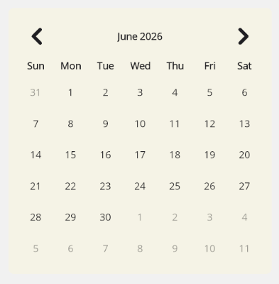

# CalendarView

`CalendarView` is a cross-platform calendar layout for single-date, multiple-date, and date-range selection. It is rendered with MAUI controls instead of native calendar views, so nullable selection, min/max behavior, and same-date selection are consistent across platforms.

## Usage

It is defined in the `UraniumUI.Controls` namespace. You can use it in XAML like this:

```xml
xmlns:uranium="http://schemas.enisn-projects.io/dotnet/maui/uraniumui"
```

Then you can use it with the `uranium:CalendarView` tag.

```xml
<uranium:CalendarView
    SelectedDate="{Binding Date}"
    MinimumDate="{Binding MinimumDate}"
    MaximumDate="{Binding MaximumDate}" />
```



## Properties

- **SelectionMode**: The active selection behavior. Supports `Single`, `Multiple`, and `Range`. The default is `Single`.
- **SelectedDate**: The selected date for `Single` mode. Supports `DateTime?` and can be `null`.
- **SelectedDates**: The selected dates for `Multiple` mode. Supports `IList<DateTime>`.
- **RangeStartDate**: The selected range start for `Range` mode. Supports `DateTime?` and can be `null`.
- **RangeEndDate**: The selected range end for `Range` mode. Supports `DateTime?` and can be `null`.
- **DisplayDate**: The month currently displayed by the calendar.
- **MinimumDate**: The earliest selectable date. Dates before this value are disabled.
- **MaximumDate**: The latest selectable date. Dates after this value are disabled.
- **FirstDayOfWeek**: The first weekday column. Defaults to the current culture's first day of week.
- **VisibleDates**: The 42 visible calendar cells for the current display month.

## Selection

`CalendarView` raises `DateSelected` when a selectable day is tapped, even if the tapped date is already selected. This is useful for picker flows where confirming the same date should still be treated as a user action.

```csharp
calendarView.DateSelected += (sender, args) =>
{
    var selectedDate = args.SelectedDate;
};
```

You can also select or clear dates from code:

```csharp
calendarView.TrySelectDate(DateTime.Today);
calendarView.ClearSelection();
```

`ClearSelection()` clears `SelectedDate`, `SelectedDates`, `RangeStartDate`, and `RangeEndDate` regardless of the active selection mode.

## Multiple Selection

Use `SelectionMode="Multiple"` and bind `SelectedDates` when users can select more than one day.

```xml
<uranium:CalendarView
    SelectionMode="Multiple"
    SelectedDates="{Binding SelectedDates}" />
```

Tapping a selectable day toggles that date in `SelectedDates`. Tapping a disabled day does nothing.

## Range Selection

Use `SelectionMode="Range"` and bind `RangeStartDate` and `RangeEndDate` when users can select a continuous range.

```xml
<uranium:CalendarView
    SelectionMode="Range"
    RangeStartDate="{Binding StartDate}"
    RangeEndDate="{Binding EndDate}" />
```

The first selectable tap sets `RangeStartDate` and clears `RangeEndDate`. The second selectable tap completes the range. If the second tap is before the first tap, the start and end are normalized into date order. Tapping the same date twice creates a one-day range. After a complete range is selected, the next selectable tap starts a new range.

`MinimumDate` and `MaximumDate` disable out-of-range days for all selection modes, so disabled dates cannot be selected as multiple dates or range endpoints.

## Year Selection

Tap the month/year header to switch from the day grid to a year grid. This is useful for birthdate and other historical-date flows where navigating month-by-month would be too slow. The previous/next navigation buttons move between year pages while the year grid is visible. Selecting a year returns to the day grid and keeps the current month where possible.

## Accessibility

`CalendarView` uses MAUI `Button` controls for day and year selection, so selectable dates stay in the platform control model. Previous and next navigation buttons expose semantic descriptions such as "Previous month" and "Next month".

When embedding `CalendarView` in a dialog or custom surface, provide a clear title and instructions near the calendar. If the selected date, disabled date range, or current month needs extra explanation for your users, add nearby text or semantic hints in the surrounding dialog.

For keyboard-heavy flows, verify the full date-selection path in the target platform. See the accessibility follow-up report in the repository for known improvements around month/year header activation and grid-style arrow navigation.

## Styling

The view exposes style classes for common parts:

- `CalendarView`
- `CalendarView.Header`
- `CalendarView.MonthLabel`
- `CalendarView.NavigationButton`
- `CalendarView.PreviousMonthButton`
- `CalendarView.NextMonthButton`
- `CalendarView.WeekdayGrid`
- `CalendarView.WeekdayLabel`
- `CalendarView.DaysGrid`
- `CalendarView.DayButton`
- `CalendarView.DayButton.OutsideMonth`
- `CalendarView.DayButton.Disabled`
- `CalendarView.DayButton.Selected`
- `CalendarView.DayButton.MultipleSelected`
- `CalendarView.DayButton.RangeStart`
- `CalendarView.DayButton.RangeMiddle`
- `CalendarView.DayButton.RangeEnd`
- `CalendarView.YearGrid`
- `CalendarView.YearButton`
- `CalendarView.YearButton.Disabled`
- `CalendarView.YearButton.Selected`
