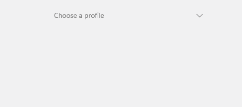
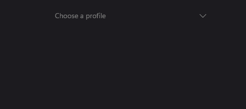
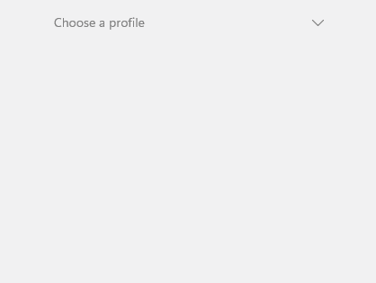
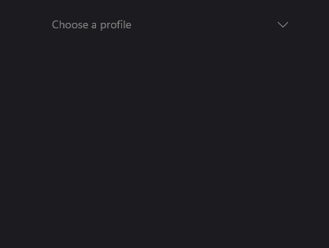

# Select

`Select` is a pure MAUI single-selection control that opens an overlay-hosted list of items. It is an opt-in alternative to `Dropdown` when you need templated item rows, a templated selected value, or more control over the popup colors and sizing.

## Usage

`Select` is defined in the `UraniumUI.Controls` namespace.

You can access it in XAML with the default UraniumUI namespace:

```xml
xmlns:uranium="http://schemas.enisn-projects.io/dotnet/maui/uraniumui"
```

Then use it like this:

```xml
<uranium:Select
    Placeholder="Choose a profile"
    ItemsSource="{Binding Profiles}"
    SelectedItem="{Binding SelectedProfile}"
    ItemDisplayBinding="{Binding Name}" />
```

| Light | Dark |
| --- | --- |
|  |  |

## Templates

Use `ItemTemplate` to customize the rows shown in the opened list. Use `SelectedItemTemplate` when the closed selected value should use a more compact visual than the list rows.

```xml
<uranium:Select
    Placeholder="Choose a profile"
    ItemsSource="{Binding Profiles}"
    SelectedItem="{Binding SelectedProfile}">
    <uranium:Select.ItemTemplate>
        <DataTemplate>
            <Grid Padding="12" ColumnDefinitions="36,*" ColumnSpacing="12">
                <Border WidthRequest="32" HeightRequest="32" StrokeThickness="0" BackgroundColor="{Binding Color}">
                    <Border.StrokeShape>
                        <RoundRectangle CornerRadius="16" />
                    </Border.StrokeShape>
                    <Label Text="{Binding Initial}" TextColor="White" FontAttributes="Bold" HorizontalOptions="Center" VerticalOptions="Center" />
                </Border>
                <VerticalStackLayout Grid.Column="1" Spacing="2">
                    <Label Text="{Binding Name}" FontAttributes="Bold" />
                    <Label Text="{Binding Description}" FontSize="Micro" Opacity=".65" />
                </VerticalStackLayout>
            </Grid>
        </DataTemplate>
    </uranium:Select.ItemTemplate>
</uranium:Select>
```

| Light | Dark |
| --- | --- |
|  |  |

If `SelectedItemTemplate` is not set, `Select` uses `ItemTemplate` for the closed selected value. If no template is set, it uses `ItemDisplayBinding` or `ToString()`.

## Keyboard and accessibility

`Select` is focusable by keyboard. It uses the platform focus visual provided by UraniumUI's focusable content handler and exposes generated semantic description/hint text from the selected value or placeholder.

| Key | Behavior |
| --- | --- |
| `Tab` | Moves focus to and from the closed control. |
| `Enter` / `Space` | Opens the list. When the list is open, selects the active item. |
| `Down` / `Up` | Opens the list and moves the active item. |
| `Home` / `End` | Moves to the first or last item while the list is open. |
| `Escape` | Closes the list without changing selection. |

When using `ItemTemplate` or `SelectedItemTemplate`, keep meaningful text in the template or set `SemanticProperties.Description` yourself if the selected value is represented by icons, color chips, avatars, or abbreviations. The opened list is keyboard-controlled by the parent `Select`, so item templates should not introduce pointer-only actions unless they are redundant.

## Properties

| Property | Description |
| --- | --- |
| `ItemsSource` | The collection of items to display. |
| `SelectedItem` | The selected item. The default binding mode is `TwoWay`. |
| `ItemDisplayBinding` | Binding used to display item text when no item template is provided. |
| `ItemTemplate` | Template used for each opened list item. |
| `SelectedItemTemplate` | Template used for the closed selected value. Falls back to `ItemTemplate`. |
| `Placeholder` | Text shown when no item is selected. |
| `PlaceholderColor` | Color of the placeholder text and arrow when empty. |
| `TextColor` | Color of the selected text and arrow when a value is selected. |
| `HorizontalTextAlignment` | Horizontal alignment for text fallback content. |
| `MaxDropDownHeight` | Maximum height of the opened list. |
| `DropDownMargin` | Spacing between the anchor and popup edges. |
| `DropDownBackgroundColor` | Popup background color. |
| `DropDownBorderColor` | Popup border color. |
| `DropDownBorderThickness` | Popup border thickness. |
| `DropDownCornerRadius` | Popup corner radius. |
| `DropDownShadow` | Popup shadow. |
| `SelectedItemBackgroundColor` | Background color applied to the selected row in the opened list. |
| `HoveredItemBackgroundColor` | Background color applied while hovering an item. |
| `PressedItemBackgroundColor` | Background color applied while pressing an item. |

## Methods

| Method | Description |
| --- | --- |
| `Open()` | Opens the list if the control is enabled and not already open. |
| `Close()` | Closes the list if it is open. |

## Notes

`Select` closes its overlay when its handler is detached or when `ItemsSource` changes. Call `Close()` before navigation if your page flow needs deterministic cleanup.
